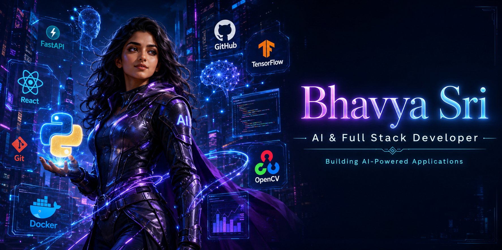

  

  

## 👋 Welcome to my GitHub

I'm passionate about building AI-powered applications, scalable backend systems, and modern full-stack solutions.

 

 

## 🙋‍♀️ About Me

- 🎓 I'm a B.Tech Computer Science Engineering student at Anurag University, Hyderabad (CGPA: 8.76), graduating in 2027
- 💼 Currently an **AI Intern at XTRAGRAD Pvt. Ltd.**, under the **AICTE Internship Initiative** — working on AI/ML features under industry mentorship, from prototyping through code review and documentation
- 🌱 Open source contributor with **GirlScript Summer of Code (GSSoC)**, where I've triaged and resolved 30+ issues and PRs across active repositories
- 🧑‍💻 I like building things end-to-end — from REST APIs and databases to the React frontends that sit on top of them
- 🧠 Currently exploring **LLMs, RAG pipelines, and prompt engineering** through my own projects
- 📫 You can reach me at **23eg105p02@gmail.com**

 

## 🔭 Currently Working On

- 🤖 Shipping AI/ML features as part of my internship at XTRAGRAD Pvt. Ltd.
- 🧩 Contributing to open-source issues and PRs through GSSoC
- 📚 Deepening my understanding of RAG architectures and vector search
- 🎯 Practicing DSA consistently and taking part in coding contests

 

## 🛠️ Tech Stack

**Languages**

     

**Frontend**

   

**Backend**

  

**Databases**

  

**Cloud & Tools**

     

**AI / ML & GenAI**

    

 

## 💡 Featured Projects

### 🚀 CIFAKE – Real vs AI Generated Image Classification

Deep learning–based image classification system...

### 🔹 [Intelli Credit](https://intelli-credit-kappa.vercel.app/)
A multi-stage RAG-based credit appraisal engine combining OCR document extraction, vector retrieval, and LLM-based scoring. I built the FastAPI backend and PostgreSQL schema powering the OCR-to-scoring pipeline, along with a risk-scoring and audit-trail module that cut manual review effort by ~50%.
`React.js` `Python` `FastAPI` `PostgreSQL` `OCR` `LLMs`

### 🔹 [Smart Health Advisor AI](https://smart-health-advisor-ai-for-healthc.vercel.app/)
An NLP-driven symptom-analysis system. I built the React.js frontend and connected it to an async FastAPI backend, cutting query latency by ~40%, and improved recommendation accuracy by ~35% through tokenization caching and refined NLP logic.
`React.js` `Python` `NLP` `FastAPI` `MongoDB`

### 🔹 [Anonymous Chat Platform](https://anon-chat2.vercel.app/)
A real-time anonymous chat platform with a React.js frontend and a Node.js/Express.js backend, using WebSockets for bidirectional messaging and session-based anonymity across multiple concurrent chat rooms.
`React.js` `Node.js` `Express.js` `WebSockets`

### 🔹 [Student Marks Prediction](https://github.com/bhavyaxtech/Student_Marks_Prediction)
A machine learning project that predicts student marks based on study hours using Linear Regression. Developed with Python, Pandas, and Scikit-learn, covering data preprocessing, visualization, model training, and prediction.
`Python` `Pandas` `Matplotlib` `Scikit-learn`

 
## 📌 Featured Repositories

## 📊 GitHub Analytics

 

## 📈 Contribution Graph

## 🏆 Coding Profiles

 

## 🤝 Connect With Me

 

## 🏅 Achievements & Certifications

- Solved 100+ DSA problems on LeetCode
- Top 1,000 among 3,000+ teams – Hack With Hyderabad 2026
- Google Cloud Foundation certifications in ML, AI, and Generative AI
- Salesforce Trailhead: 7,100+ points, Agentblazer Champion '26 — Agentforce & AI learning pathways completed
- Cisco: CCNA Track, Packet Tracer, Network Technician Path; Python Essentials 1 & 2, Intro to Data Science, Modern AI, Generative AI, AI Fundamentals, Prompt Engineering

 

Thanks for visiting my profile — feel free to check out my repositories or reach out!

